# FaceMask-Detection Using Deep Learning Approach 😷

## 🚀 Overview

This repository implements a deep learning-based face mask detection system using **PyTorch** and **MobileNetV2** architecture. The model classifies images into two classes:

- `with_mask`
- `without_mask`

The project includes a complete pipeline for data preprocessing, training, validation, evaluation, and inference.

---

## 🚀 Features

- MobileNetV2 architecture optimized for face mask detection.
- Data augmentation to improve generalization.
- Automatic train-validation split.
- Training progress visualization including accuracy and loss curves.
- Model saving and loading for inference.
- Sample prediction on test images.

---

## 📁 Repository Structure

| File/Folder              | Description                              |
|-------------------------|------------------------------------------|
| `facemask-detection.ipynb` | Jupyter notebook with full training and evaluation code |
| `requirements.txt`       | List of required Python packages          |
| `face_mask.pth`          | Trained model weights                      |
| `Outputs/`               | Folder containing outputs images |

---

## 🧠 Model Architecture Details

| Parameter                | Value                                  |
|-------------------------|----------------------------------------|
| Base Model              | MobileNetV2                            |
| Input Image Size        | 224 x 224 pixels                      |
| Number of Classes       | 2 (with_mask, without_mask)            |
| Optimizer               | Adam                                 |
| Learning Rate           | 0.001                                |
| Loss Function           | CrossEntropyLoss                     |
| Batch Size              | 32                                   |
| Number of Epochs        | 20                                   |

---

## 🧭 Workflow Diagram

The following diagram outlines the high-level steps followed in the Face Mask Detection pipeline:

```mermaid
graph TD
    A([🔽 Start]) --> B([📁 Load Dataset])
    B --> C([🧹 Preprocess & 🧪 Augment Images])
    C --> D([📦 Load MobileNetV2 Model])
    D --> E([🎯 Train the Model])
    E --> F([✅ Validate Performance])
    F --> G([💾 Save Trained Model])
    G --> H([🧠 Make Predictions on Test Images])
    H --> I([📊 Visualize Results])
    I --> Z([🏁 End])
```



## 📂 Dataset

The dataset used for training and evaluating this face mask detection model contains images of individuals **with** and **without** face masks. It is publicly available and pre-organized into class-wise folders.

### 🔗 Download Link

You can download the dataset from the following source:

👉 [Face Mask Detection Dataset (Kaggle)](https://www.kaggle.com/datasets/omkargurav/face-mask-dataset)  
<sub>*(If you use a different dataset, replace the link above accordingly.)*</sub>

### 📁 Dataset Structure

After downloading, the dataset should be structured like this:

- `with_mask/`: Contains images of people wearing face masks.
- `without_mask/`: Contains images of people without masks.

### 📊 Dataset Statistics

| Class         | Number of Images |
|---------------|------------------|
| With Mask     | 3725            |
| Without Mask  | 3828           |
| **Total**     | 7553       |


## 🔧 Installation

```bash
git clone https://github.com/suman2896/FaceMask-Detection.git
cd FaceMask-Detection
pip install -r requirements.txt
```

<h2>📊 Training Results and Evaluation</h2>

<table>
  <tr>
    <td align="center">
      <h3>✅ Accuracy Curve</h3>
      
    </td>
    <td align="center">
      <h3>📉 Loss Curve</h3>
      
    </td>
  </tr>
</table>

<table>
  <tr>
    <td align="center">
      <h3>✅ Confusion Matrix</h3>
      
    </td>
    <td align="center">
      <h3>📉 Metrics Curve</h3>
      
    </td>
  </tr>
</table>


<table>
  <tr><th>Epoch</th><th>Training Acc</th><th>Val Acc</th><th>Training Loss</th><th>Val Loss</th></tr>
  <tr><td>1</td><td>0.8479</td><td>0.9715</td><td>0.3437</td><td>0.1226</td></tr>
  <tr><td>2</td><td>0.8928</td><td>0.9696</td><td>0.2641</td><td>0.1007</td></tr>
  <tr><td>3</td><td>0.8899</td><td>0.9742</td><td>0.2559</td><td>0.0860</td></tr>
  <tr><td>4</td><td>0.9012</td><td>0.9775</td><td>0.2386</td><td>0.0722</td></tr>
  <tr><td>...</td><td>...</td><td>...</td><td>...</td><td>...</td></tr>
  <tr><td>20</td><td>0.9038</td><td>0.9768</td><td>0.222</td><td>0.0735</td></tr>
</table>

<h2>🖼️ Sample Predictions</h2>

<table>
  <tr>
    <td align="center">
      <h3>✅ Output-1</h3>
      
    </td>
    <td align="center">
      <h3>✅ Output-2</h3>
      
    </td>
  </tr>
</table>


## 🤝 Contributing

Contributions are welcome and appreciated! 🚀

To contribute:

1. Fork the repository.
2. Create your feature branch:
   ```bash
   git checkout -b feature-name
  
3. Commit your changes:
   ```bash
   git commit -m "Add feature"
  
4. Push to the branch:
   ```bash
   git push origin feature-name
  
5. Open a pull request describing your changes.
- Feel free to submit suggestions, issues, or improvements!
